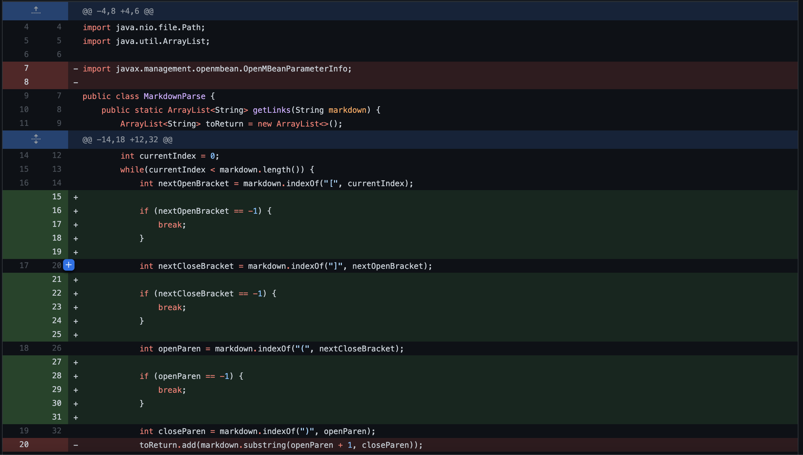
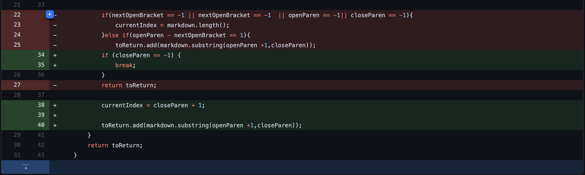
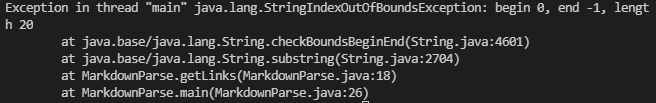
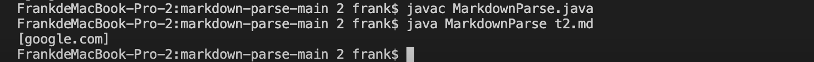
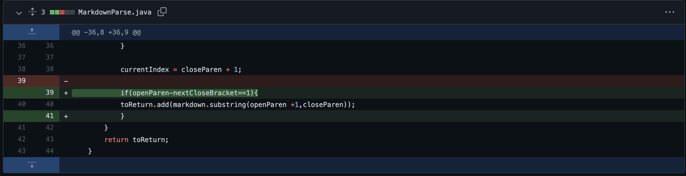

# Lab2 Report

1st bug  

  

Link to failure test file:  
[failure-bug1](https://github.com/yaz067/markdown-parse/blob/main/t1.md)

The terminal output like this:  

## Demostration:   
Because the link format in this .md file has no parenthesis, only has [], then an exception will occur. I add if-else statment to prevent the program from continuing to run in this case.  

This bug will change the index parenthesis to -1, so programe will throw IOException.

___  

2nd bug

  
  
Link to failure test file(2 files):  
[failure-bug2](https://github.com/yaz067/markdown-parse/blob/main/t2.md)  

The terminal output like this:  
  
## Demostration:   
This bug is causing by the missing closed bracket, but as long as the parenthesis are there the program will still output the link. This is a type of bug which due to the incorrect format of the link.  

___
3rd bug

  
Link to failure test file:  
[failure-bug3](https://github.com/yaz067/markdown-parse/edit/main/t3.md)  

The terminal output like this: 
  
## Demostration:   
Since the md file contains brackets and parenthesis, it will consider it as the correct format of link.  however, this is a bug for the distance between the open paren and closed brackets. This should be considered as an error in the system. However the program will run it without anything happen.
