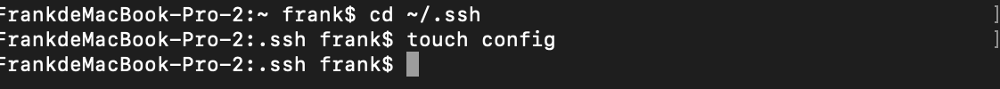
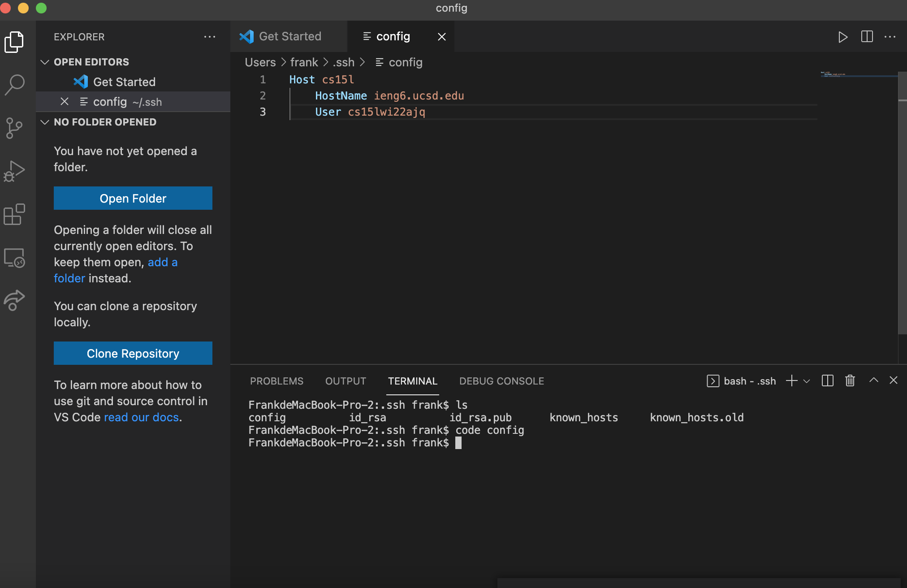
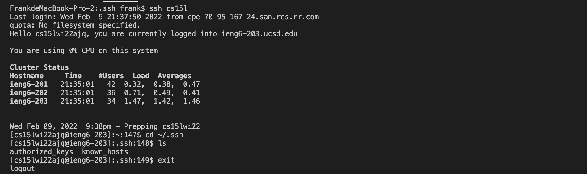

# Lab3 Report  

## ```.ssh```/config file  
Using command line below and that's how to find in Vscode:

  
I create a config file under the hidden folder using touch command. (touch config) of ssh on my local machine.  
   
Then I set up as requested in the node. I named the host cs15l and set the User with my own account.
This is my ssh Configuration:
```
Host cs15l
    HostName ieng6.ucsd.edu
    User cs15lwi22ajq (my username)
```  
In VScode like this:  
  

## ```ssh``` command logging:  
just the thing below will serve the job rather than entering redundent account name
```
ssh cs15l
```
My terminal like this:
 

## ```scp``` command:  
I create a file called random_file on the server. Then I use scp to grab it to the desktop of my local machine. 
 