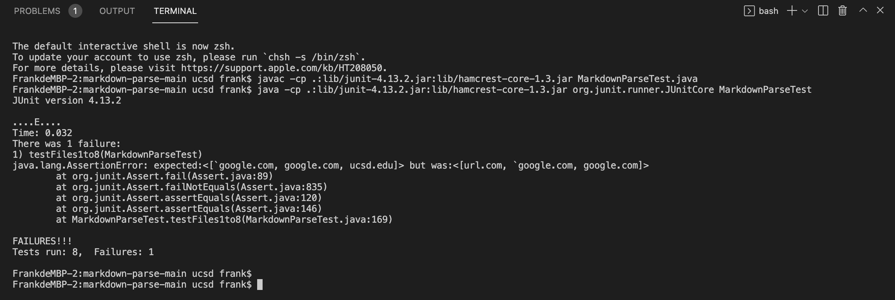

# Lab4 Report  
## Using VScode Review  
We have 3 snippets in preview right here(VScode):


  
  

## The implement reviewed
[link to reviewed repository](https://github.com/mBookUCSD/markdown-parse/blob/main/MarkdownParseTest.java)  
MarkdownParseTest.java here:  
  
  
  
In his code, we need to make new things in this file if we want to test 3 snippets. I have new those things make this 3 snippets run(next three Screeshots).

Using javac and java command make his test run.
I add some code in origin, just create three Arraylists, correctOutputs, contents, links, using 'assertEquals' to compare expected links, Screenshots show below:  
  
  
 

The terminal shows below:  
 
The snippet1 fail!!  

Demostration:  
I think he needs write more code to fix these issue(>=10 lines).  
First, he didn't consider the link with apostrophe case. We expected ```google.com```, but was ``` `google.com```.  

Second, ``` `[a link`](url.com)``` is not a link, but in his method,it as a link that shows on terminal.

  
## My implement 
[link to my repository](https://github.com/yaz067/markdown-parse)  
 
MarkdownParseTest.java here:  
 
 
In my VScode, I have 'test' and 'result' folders. For 'result' I put expected, and 'test' I put all tests, then run ```MarkdownParseTest.java``` compare two folders.  
Put command 'make' that turn it into my test, screenshot here:  
 

Demostration:
I think I may add more code to fix this issue(>=10 lines). We expected have ```a.com(())```,but my method have ```a.com((```. I may consider the case that if we put more parentheses(opend and closed both)the method can read.

