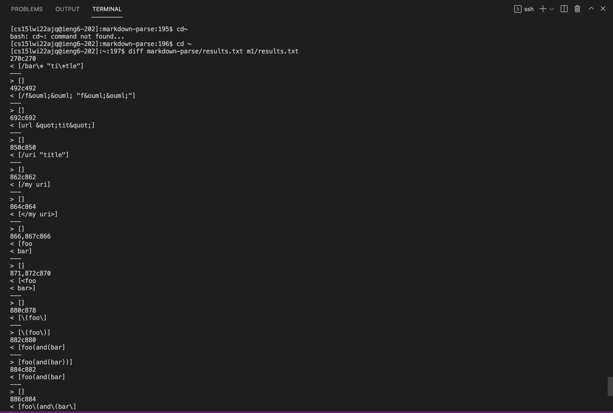
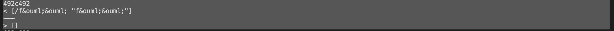
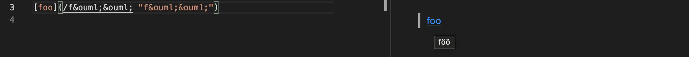
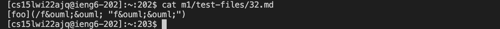
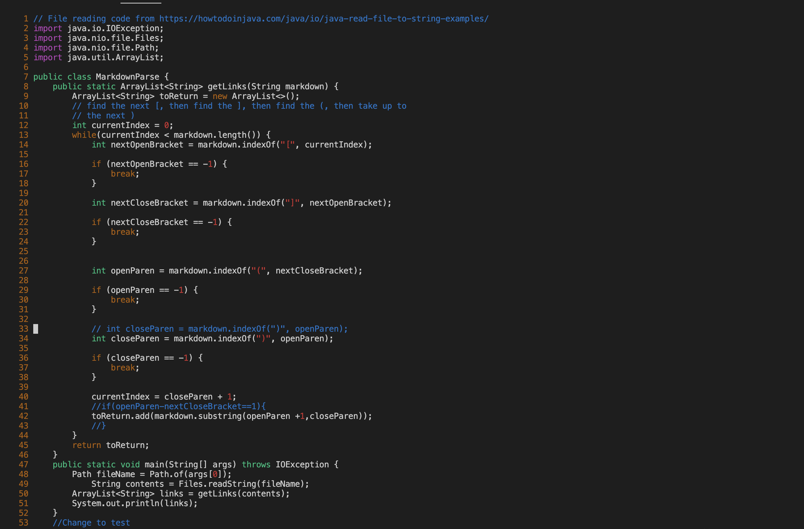
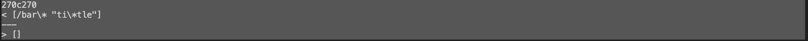
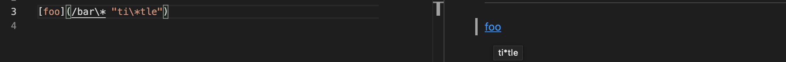
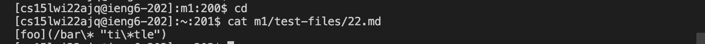

# Lab5 Report  
## Use 'diff'  

Use 'diff' on the results of running a bash.  
The screeshot show below:
  

## Implemetations  
There are two implemetations are not correct, screeshots show below:  
### 1.  
The first test output: 
  
The expected output like this:  

This is our expected output ```"/f&ouml;&ouml;"```
  
Corresponding md file:  
  
md file content:  
  
Demostration:  
Code needs to fix, for two programs we need to fix the case like quotation mark inside parenthesis. Quotation mark is like comment inside the link.  
The line between 33 and 43, we need fix the code handle this case.
  
### 2.  
The second test output:

The expected output like this:  

This is our expected output ```"/bar\*"```

Corresponding md file:  
  
md file content:  
  
Demostration:  
Code still need to fix, this case is similar to first case. We still need add more code between line 33 and 43.  


