# Lab Report Week2

## Visual Studio Code

How to install Visual Studio Code?  
Go to [visual studio](https://code.visualstudio.com/) wesite and click the download botton.
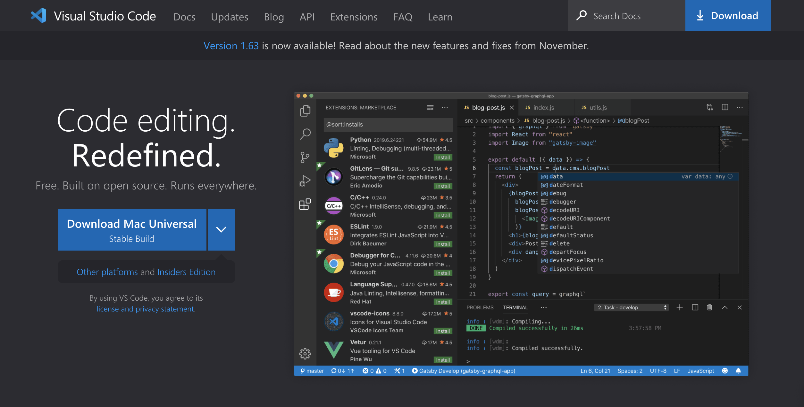  

## Remotely Connecting

### 1st step(Install OpenSSH):  

If you're on Windows([go to this link](https://docs.microsoft.com/en-us/windows-server/administration/openssh/openssh_install_firstuse)):  
https://docs.microsoft.com/en-us/windows-server/administration/openssh/openssh_install_firstuse  


## 2nd step([look up](https://sdacs.ucsd.edu/~icc/index.php) your course-specific account for CSE15L):  

> https://sdacs.ucsd.edu/~icc/index.php

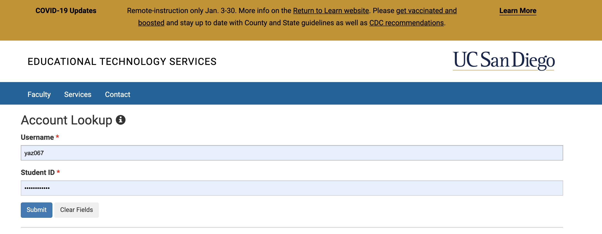  


## 3rd step  


In Visual Studio Code, we are going to connect to the remote computer using VSCode’s remote option. Following the [reference](https://code.visualstudio.com/docs/remote/ssh#_connect-to-a-remote-host) step.  
https://code.visualstudio.com/docs/remote/ssh#_connect-to-a-remote-host  


## 4th step  


1. Open a terminal in VSCode (Ctrl or Command + `, or use the Terminal → New Terminal menu option).  Your command will look like this, but with the 'zz' replaced by the letters in your course-specific account(ajq).  
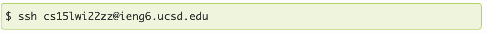  

2. The first time you’ve connected to this server, you will  get a message like this:  
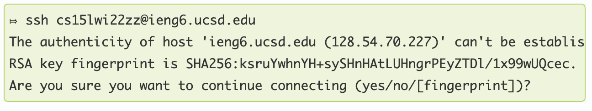  

3. So type yes and press enter, then give your password; the whole interaction should look something like this once you give your password and are logged in:  
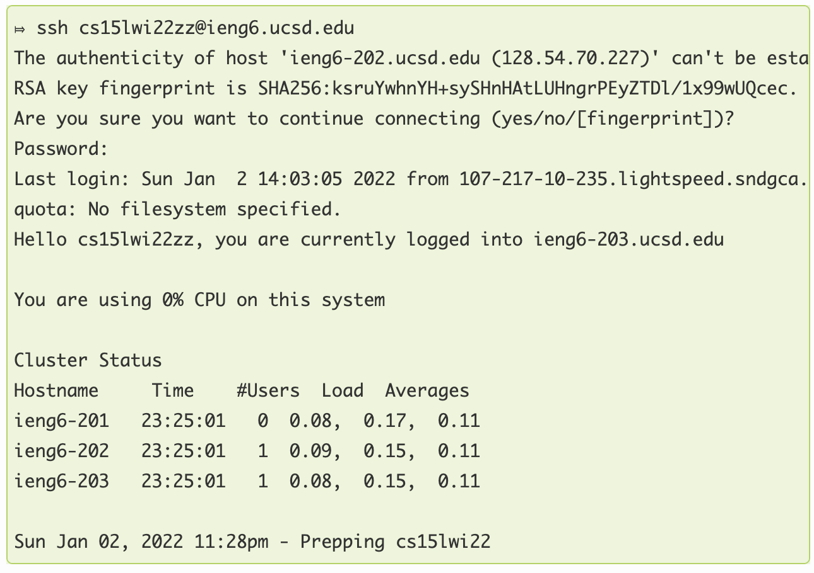  

4. In Visual Studio, my ternimal look like this(my account):  

```bash
ssh cs15lwi22ajq@ieng6.ucsd.edu
```

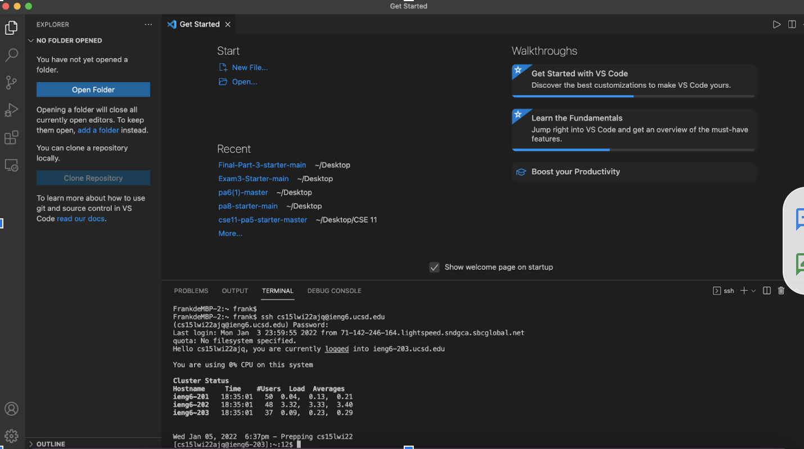     

## Trying Some Commands

Try some Commands below: 

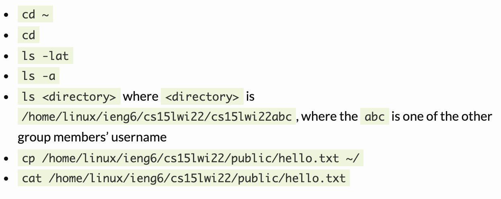  

The 'ls' output like this:

```bash
ls
```

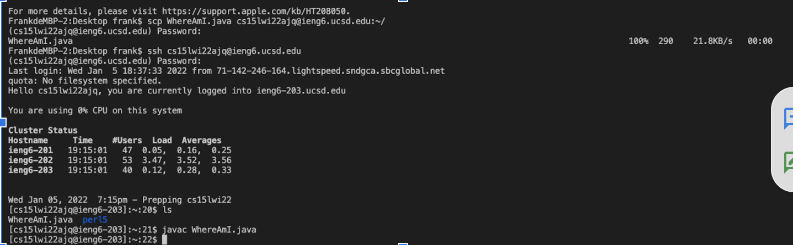  

```bash 
ls -a
```  

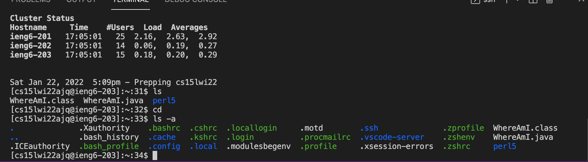 

### Moving Files with scp

We’ll see now another way to copy a file (or many files!) from your computer to a remote computer. The command is called 'scp', and we will always run it from the client (that means from your computer, not logged into 'ieng6'). Create a file on your computer called 'WhereAmI.java' and put the following contents into it: 

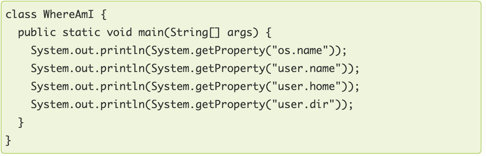 


My output like this:

- Open local terminal use 'scp' moving the 'WhereAmI.java'.  

```
scp WhereAmI.java cs15lwi22ajq@ieng6.ucsd.edu
```

- Using following(my) command to tranfer local file.

```
ssh cs15lwi22ajq@ieng6.ucsd.edu:
```

- Complie the file using following command.

```
javac WhereAmI.java 
```

- Run it!

```
java WhereAmI 
```

My terminal like this:


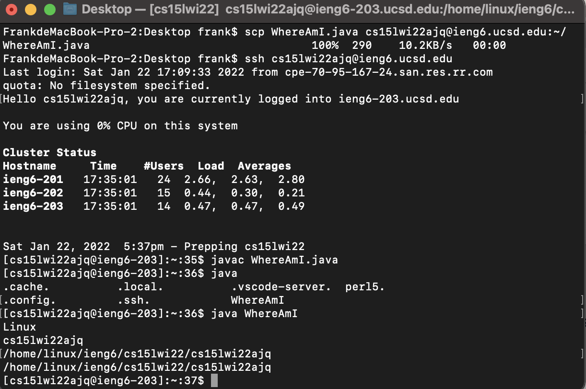 

> Notes: After using 'scp' to copy the file `WhereAmI`, I can the file and its information by 'ls -l' command. The differences of the result after compiling WhereAmI on the server are different directory and user name.  

### Setting an SSH Key

Every time we log in or run scp, we have to type (or copy-paste) our password many times. There's way can this this problem -- ssh key. The idea behind ssh keys is that a program, called ssh-keygen, creates a pair of files called the public key and private key. You copy the public key to a particular location on the server, and the private key in a particular location on the client. Then, the ssh command can use the pair of files in place of your password.  

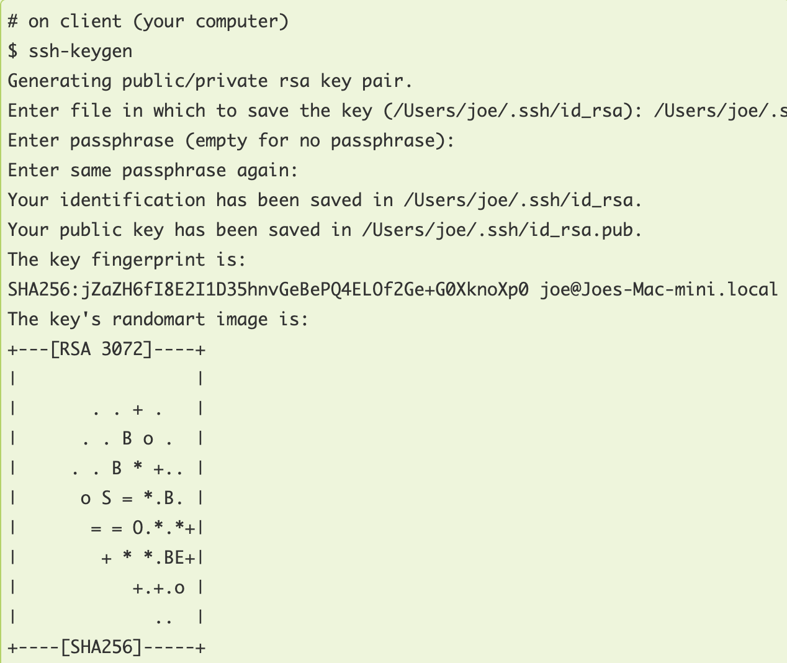  

In my terminal like this:  

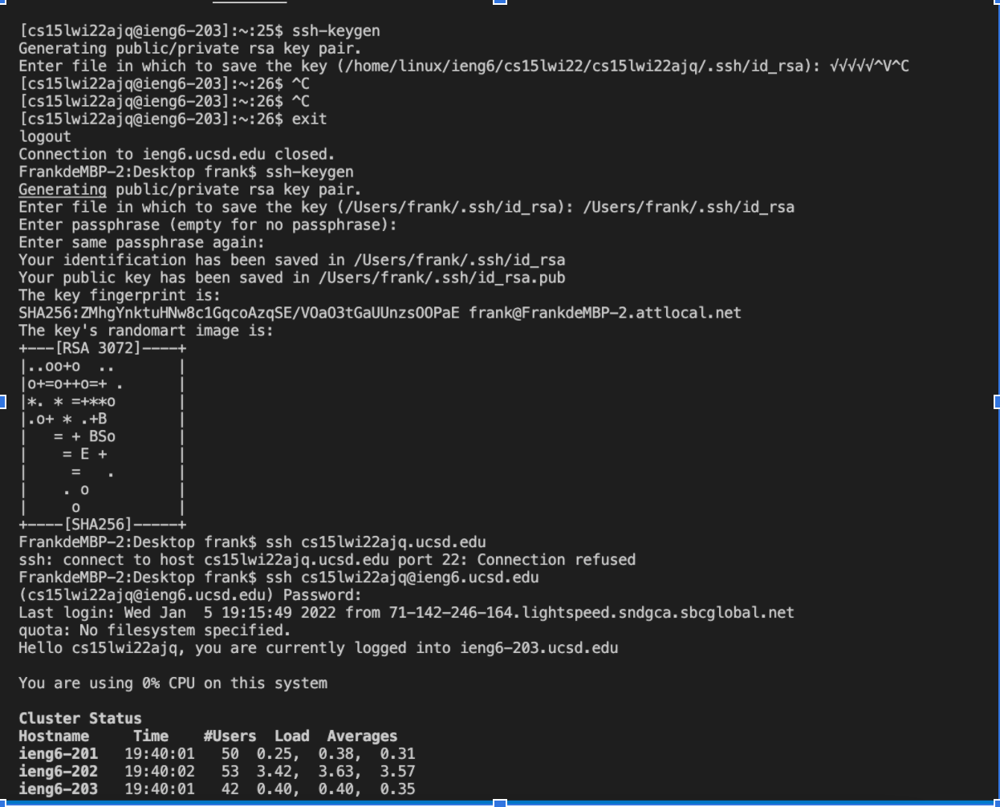  

## Optimizing Remote Running

There are two ways that we can run it!
1)You can write a command in quotes at the end of an ssh command to directly run it on the remote server, then exit.  


You can use semicolons to run multiple commands on the same line in most terminals. For example:

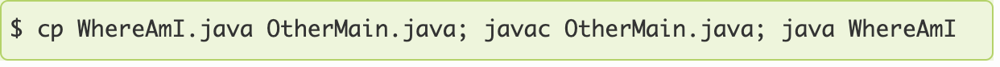  

